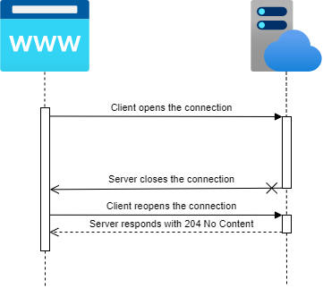

# Disconneting Clients

There is an option to disconnect a client from server. The flow is based on responding with *204 No Content* status code to reconnect attempt.

<center></center>

## Prerequisites

The client disconnect functionality requires registering two services, which are not registered by default.

### Client Identifier Provider

First is implementation of [`IServerSentEventsClientIdProvider`](../api/Lib.AspNetCore.ServerSentEvents.IServerSentEventsClientIdProvider.html), which responsibility is to provide an identifier for a client. This identifier should remain the same if client performs reconnect(s). There is no ready to use implementation of this provider, as the approach to this should strongly depend on context. Below is a sample cookie based implementation (which is certainly not sophisticated enough for production scenarios).

```cs
internal class CookieBasedServerSentEventsClientIdProvider : IServerSentEventsClientIdProvider
{
    private const string COOKIE_NAME = ".ServerSentEvents.Guid";

    public Guid AcquireClientId(HttpContext context)
    {
        Guid clientId;

        string cookieValue = context.Request.Cookies[COOKIE_NAME];
        if (String.IsNullOrWhiteSpace(cookieValue) || !Guid.TryParse(cookieValue, out clientId))
        {
            clientId = Guid.NewGuid();

            context.Response.Cookies.Append(COOKIE_NAME, clientId.ToString());
        }

        return clientId;
    }

    public void ReleaseClientId(Guid clientId, HttpContext context)
    {
        context.Response.Cookies.Delete(COOKIE_NAME);
    }
}
```

There is a helper method which simplifies registering an implementation.

```cs
public class Startup
{
    ...

    public void ConfigureServices(IServiceCollection services)
    {
        services.AddServerSentEvents();

        // Register cookie based clients identifier provider for Server Sent Events
        services.AddServerSentEventsClientIdProvider<CookieBasedServerSentEventsClientIdProvider>();

        ...
    }

    ...
}
```

### "No Reconnect" Identifiers Store

Second is implementation of [`IServerSentEventsNoReconnectClientsIdsStore`](../api/Lib.AspNetCore.ServerSentEvents.IServerSentEventsNoReconnectClientsIdsStore.html), which responsibility is to store identifiers which should not be allowed to reconnect. There are two ready to use implementations. First stores the identifiers in memory, while the second is backed by distributed cache. Both have ready to use methods to register them.

```cs
public class Startup
{
    ...

    public void ConfigureServices(IServiceCollection services)
    {
        services.AddServerSentEvents();

        // Register cookie based clients identifier provider for Server Sent Events
        services.AddServerSentEventsClientIdProvider<CookieBasedServerSentEventsClientIdProvider>();

        // Register IServerSentEventsNoReconnectClientsIdsStore backed by memory store.
        services.AddInMemoryServerSentEventsNoReconnectClientsIdsStore();

        ...
    }

    ...
}
```

## Disconnecting a Client

Disconnecting a client is as simple as calling `Disconnect()` on a [`IServerSentEventsClient`](../api/Lib.AspNetCore.ServerSentEvents.IServerSentEventsClient.html).